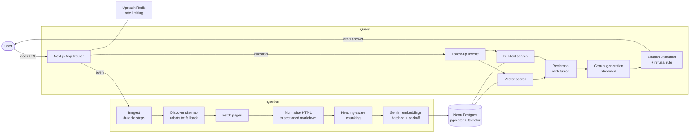
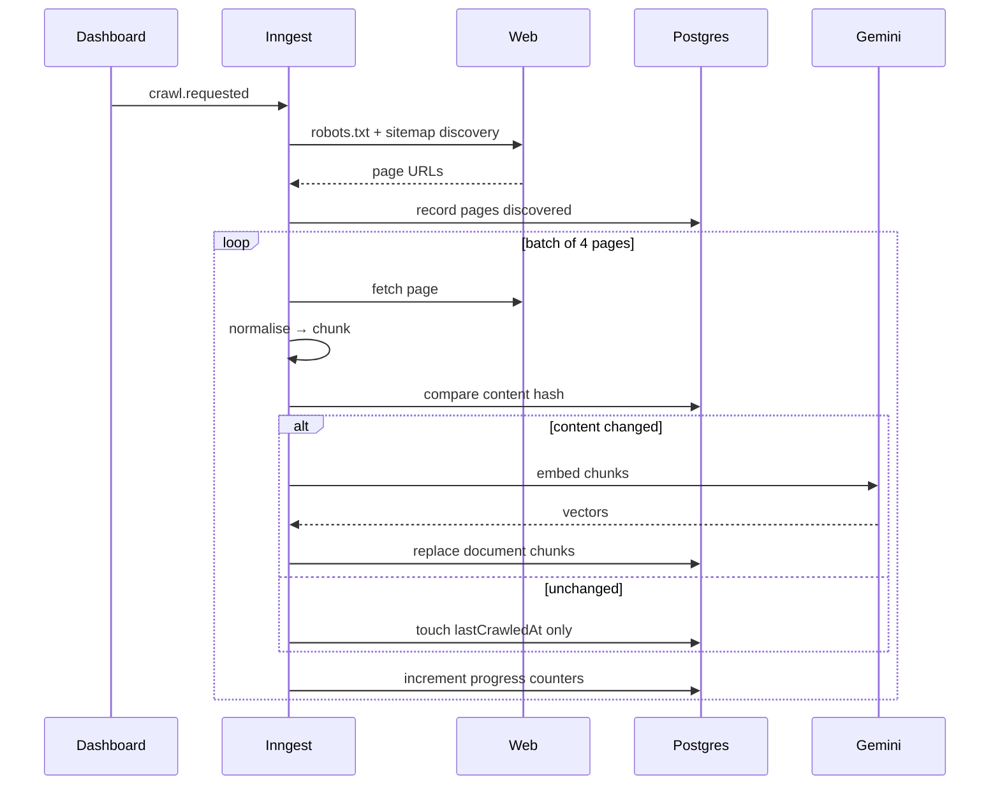
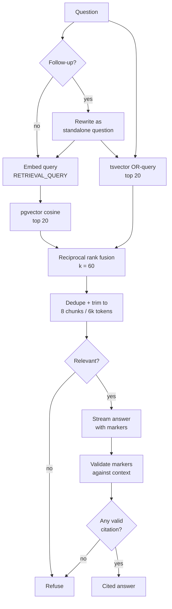

<p align="center">
  
</p>

<p align="center">
  <b>An agentic RAG answer engine for documentation sites.</b><br>
  Point it at a docs URL, and it crawls, chunks, and indexes the site — then answers questions
  with citations that deep-link to the exact heading the answer came from, or refuses when the
  documentation genuinely does not cover it.
</p>

<p align="center">
  
  
  
  
  
  
</p>

<p align="center">
  
  
  
  
</p>

---

## The problem

Documentation sites are where answers go to hide. Site search matches keywords rather than
questions, so it fails the moment a user phrases something differently from the docs. General
purpose LLM chat is worse in a specific way: it answers confidently with APIs that never
existed, and you cannot tell which sentences are real. Meanwhile documentation teams have no
signal at all about which questions their docs fail to answer.

Citeline is built around one rule: **an answer that cannot be traced back to a source is not
shipped.** Every factual sentence carries a citation, every citation is validated against the
text the model was actually given, and anything unsupported is replaced with an honest refusal.

## What it produces

A real answer from a Citeline index of the Drizzle ORM documentation, unedited:

> To create an actual database `enum` type, you can use `cockroachEnum` to declare the enum and
> assign it as a column in your table **[1]**.
>
> ```ts
> import { cockroachEnum, cockroachTable } from "drizzle-orm/cockroach-core";
>
> export const moodEnum = cockroachEnum('mood', ['sad', 'ok', 'happy']);
>
> export const table = cockroachTable('table', {
>   mood: moodEnum(),
> });
> ```
>
> Alternatively, if you are using string column types like `text`, `string`, `varchar`, or
> `char`, you can pass an `{ enum: [...] }` configuration object to infer TypeScript types
> without creating a database enum type **[2][3][4][5]**.

Each marker is a link to the precise section it came from, such as
`orm.drizzle.team/docs/cockroach/column-types#enum`.

Ask something the documentation does not cover, and it declines instead of improvising:

> **Q:** How do I fine-tune a transformer model on a GPU cluster?
>
> **A:** I could not find this in the indexed documentation. The closest topics covered are
> preparing test machines for ORM benchmarking [1][2], defining custom types [3][4], and
> setting up `drizzle-graphql` [7].

## Why it is useful

| For | Value |
| --- | --- |
| **Documentation teams** | Every unanswered question is logged, turning support noise into a prioritised list of documentation gaps. |
| **Developer support** | Deflects repetitive questions with answers engineers can verify in one click, instead of a chatbot they learn to distrust. |
| **Internal knowledge** | Runs against private or internal docs, so the index never leaves your own database. |
| **Any team burned by hallucination** | Citation validation makes fabrication structurally visible rather than a matter of trust. |

## Features

- **Sitemap auto-discovery** — give it any docs URL. It checks the URL itself, then `robots.txt`,
  then common sitemap paths. Most real documentation sites do *not* serve `/sitemap.xml`.
- **Heading-aware chunking** — splits on document structure, never mid-code-fence, and keeps the
  heading trail (`Guides › Auth › Refresh tokens`) attached for both embedding and citation.
- **Hybrid retrieval** — pgvector similarity fused with Postgres full-text search by reciprocal
  rank fusion, so exact identifiers like `pgEnum` and paraphrased questions both work.
- **Validated citations** — markers pointing outside the supplied context are stripped, and the
  survivors renumbered, so a fabricated reference can never render as a link.
- **Grounded refusal** — an answer with no valid citation is replaced by an explicit refusal that
  names what the docs *do* cover.
- **Incremental re-crawls** — content hashing means an unchanged page costs zero embedding calls.
- **Durable ingestion** — crawls run as resumable Inngest steps with retries, per-project
  concurrency limits, and live progress in the UI.
- **Query logging** — every question, its rewrite, retrieved chunks, latency, and whether it was
  answered.

## Architecture



### Ingestion pipeline



The hash comparison is what makes re-crawling cheap. On a verified re-run of a 6-page index:
**6 unchanged, 0 re-indexed, 0 embedding calls.**

### Retrieval pipeline



## Tech stack

| Layer | Choice | Why |
| --- | --- | --- |
|  | App Router, React 19, Server Actions | Streaming responses and server-side data access without a separate API tier |
|  | Strict mode throughout | Schema, retrieval results, and citations share one set of types |
|  | Serverless Postgres | Vectors and full-text live in one database, so hybrid search is one system |
|  | HNSW index, 768 dims | Truncated from Gemini's 3072 because HNSW rejects vectors above 2000 |
|  | Typed schema + migrations | SQL-shaped API, so `tsvector` columns and vector operators stay expressible |
|  | `gemini-embedding-001`, `gemini-3.6-flash` | Asymmetric embedding task types; generous free tier |
|  | Durable step functions | Crawls survive timeouts and retries without a queue to operate |
|  | Redis over HTTP | Rate limiting that works from serverless runtimes |
|  | v5, GitHub OAuth | Database-backed sessions via the Drizzle adapter |
|  | Utility CSS | No component library; the UI is deliberately small |
|  | 86 unit tests | Pure logic — chunking, fusion, citations — is tested without network or database |

Every service above runs on a **free tier**.

## Getting started

### 1. Prerequisites

Node 22 or newer, plus free accounts on
[Neon](https://neon.tech), [Google AI Studio](https://aistudio.google.com/apikey),
[Upstash](https://upstash.com), and [Inngest](https://inngest.com), and a
[GitHub OAuth app](https://github.com/settings/developers).

### 2. Install and configure

```bash
git clone https://github.com/photonGi/citeline.git
cd citeline
npm install
cp .env.example .env.local
```

Fill in `.env.local`. Each variable is documented inline in `.env.example`, including the two
that most often go wrong: use Neon's **pooled** URL for the app and the **unpooled** one for
migrations, and set the GitHub OAuth callback to `http://localhost:3003/api/auth/callback/github`.

### 3. Verify every service before writing any data

```bash
npm run check
```

This checks environment parsing, the Neon connection, `pgvector` availability, Upstash
reachability, Gemini embeddings *and* generation, GitHub OAuth credentials, and Inngest keys —
so a bad key surfaces immediately instead of halfway through a crawl.

### 4. Create the schema

```bash
npm run db:migrate    # enables pgvector, then applies migrations
```

### 5. Run it

```bash
npm run dev                                    # app on http://localhost:3003
npx inngest-cli@latest dev -u http://localhost:3003/api/inngest    # in a second terminal
```

## How to test it

**In the browser.** Sign in with GitHub, then paste a docs URL — `https://orm.drizzle.team`,
`https://docs.astro.build`, and `https://authjs.dev` all work — set *Max pages* to about 10, and
create the project. The page streams live crawl progress. When chunks appear, the Ask panel
opens; ask something the docs cover and click a citation marker to land on the exact section.
Then press **Re-crawl** and watch the counters report every page as skipped.

**From the command line**, without touching the UI:

```bash
# index a documentation site
npm run crawl -- --url https://orm.drizzle.team --name "Drizzle docs" --max 20

# ask a question and inspect the retrieval that produced the answer
npm run ask -- --project drizzle-docs-ab12 --q "How do I define a table with an enum column?"

# re-crawl the same project to prove unchanged pages cost nothing
npm run crawl -- --project drizzle-docs-ab12

# row counts and any pages that failed, with their error
npm run db:inspect
```

`npm run ask` prints the ranked chunks with the rank each strategy assigned, so you can see
exactly why a chunk surfaced:

```text
  retrieved 8 chunks in 10767ms (top similarity 0.776, lexical match: true)
    [1] CockroachDB column types › text — vector#3 lexical#1
    [2] CockroachDB column types › string — vector#2 lexical#2
    [5] CockroachDB column types › enum — vector#1 lexical#13
```

**The test suite** covers the logic where RAG quality quietly dies:

```bash
npm test        # 86 tests
npm run check   # external services
npm run lint
npm run typecheck
```

Worth reading as documentation of intent: `chunk.test.ts` asserts a fenced code block is never
split across chunks, `citations.test.ts` asserts a fabricated `[9]` against three sources is
stripped rather than rendered, and `robots.test.ts` asserts longest-match precedence with `Allow`
winning ties.

## Engineering notes

A few decisions that were driven by measurement rather than assumption.

**Lexical search was silently dead.** Postgres `plainto_tsquery` joins every term with `AND`, so
a question like *"how do I define a table with an enum column"* required one chunk to contain all
of those words — it matched nothing, and half of hybrid search returned an empty set with no
error. Rewriting the operators to `OR` fixed it; `ts_rank` still favours chunks covering more of
the question. No unit test would have caught this, because the SQL was valid.

**Markdown escaping broke identifier search.** Turndown escapes punctuation by default, turning
`expires_in` into `expires\_in`. Since that text feeds `tsvector`, the backslash broke lexical
matching on exactly the API identifiers hybrid retrieval exists to catch.

**`/sitemap.xml` is not a reliable convention.** Of ten popular documentation sites tested, most
do not serve it; Drizzle's `robots.txt` points to `/sitemap-index.xml` instead. Several return
HTTP 200 with an HTML page for a missing sitemap, so the response body is inspected rather than
the status code.

**The similarity threshold is not load-bearing, and the code says so.** Measured against
`gemini-embedding-001`, an off-topic question scored 0.591 where a relevant one scored 0.776 — too
close for a threshold to separate. Refusal is therefore enforced by the prompt and by citation
validation, with the threshold left as a backstop until it can be calibrated against an
evaluation set.

**Embeddings are asymmetric.** Stored chunks use `RETRIEVAL_DOCUMENT` and questions use
`RETRIEVAL_QUERY`; using one task type for both measurably degrades retrieval.

## Project structure

```text
src/
  app/
    api/projects/[slug]/ask/   streaming NDJSON answer endpoint
    api/inngest/               durable function handler
    dashboard/                 project list, crawl progress, ask panel
  lib/
    ingest/      discover · fetch · normalise · chunk · hash · index-page
    retrieval/   vector + full-text search, reciprocal rank fusion
    answer/      prompt construction, follow-up rewrite, citation validation
    embed/       batched embedding with retry and backoff
    inngest/     client and crawl-source step function
    db/          Drizzle schema, lazy client, URL normalisation
scripts/
  check-services.ts   verify all eight external dependencies
  crawl.ts            index a site or re-crawl a project
  ask.ts              run retrieval + answer, printing ranked chunks
  db-inspect.ts       row counts and failed pages
docs/
  design.md           the design spec this was built from
```

## Roadmap

- [ ] Evaluation harness: golden question set, retrieval metrics, and an ablation showing hybrid
      retrieval beats vector-only
- [ ] Embeddable widget — a script tag with Shadow DOM isolation for external docs sites
- [ ] Content-gap report built from the query log's unanswered questions
- [ ] Public demo projects, readable without signing in
- [ ] Answer feedback, and conversation history in the UI

## License

MIT
